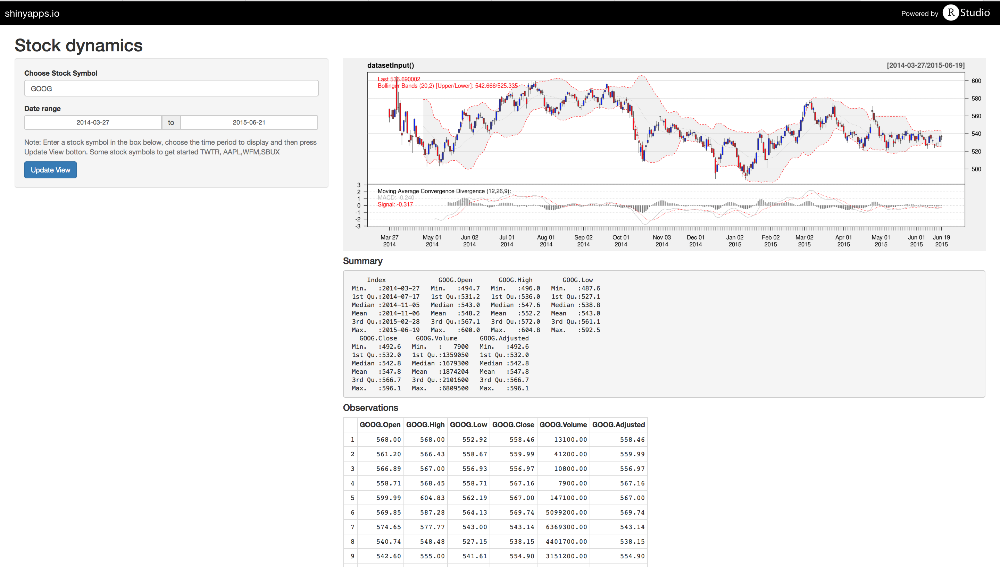

Shiny Stock Dynamics App
========================================================
author: Karunesh Arora
date: 06-21-2015

Need for developing the stock app
========================================================

- Uptodate and accurate information about the stock pricing data has economic implications.

- Understanding stock performance over a certain time period can guide user investment in the stock with some confidence.

- Currently, the quantmod package in R makes it simple to download and graph pricing data from a variety of sources.

- However, some knowledge of R and programming is required to use the package. 

- There is need to develop an app that any user who has no knowledge of R
or programming can extract useful insights into stock pricing with few mouse clicks.

About the app
========================================================
We have developed an stock app that is wrapper for the quantmod package in R.

Features of the app are:
- Provides the graphical summary of the stock pricing data.
- Executes summary of the pricing data and gives the glimpse of the 10 observation
of the stock data.
- Allows for user input of stock symbol and time period over which to follow the 
stock pricing data.

Access the app

- Link to use the app is here  https://dynamics77.shinyapps.io/stockApp
 
- Link to the code and readme can be found here  https://github.com/dynamics77/dataproducts_coursera

Stock app interface
========================================================

Conclusions
========================================================
Following the performance of the stock has important economic implications

- We have developed and deployed online a simple shiny app that shows the performance of the stock over the time period selected by the user.

- Our app combines graphical display of the stock performance with the 
textual summary, and displays 10 observations of the choosen stock in the table format.

- App can be improved further by adding an ability to compare stocks with each other or overall market trend for the choosen time period.

 
Acknowledgments
========================================================
Our instructors:

- Brian Caffo
- Roger Peng

RStudio shiny app gallery for code inspiration and amazing tools

- http://shiny.rstudio.com/gallery/
